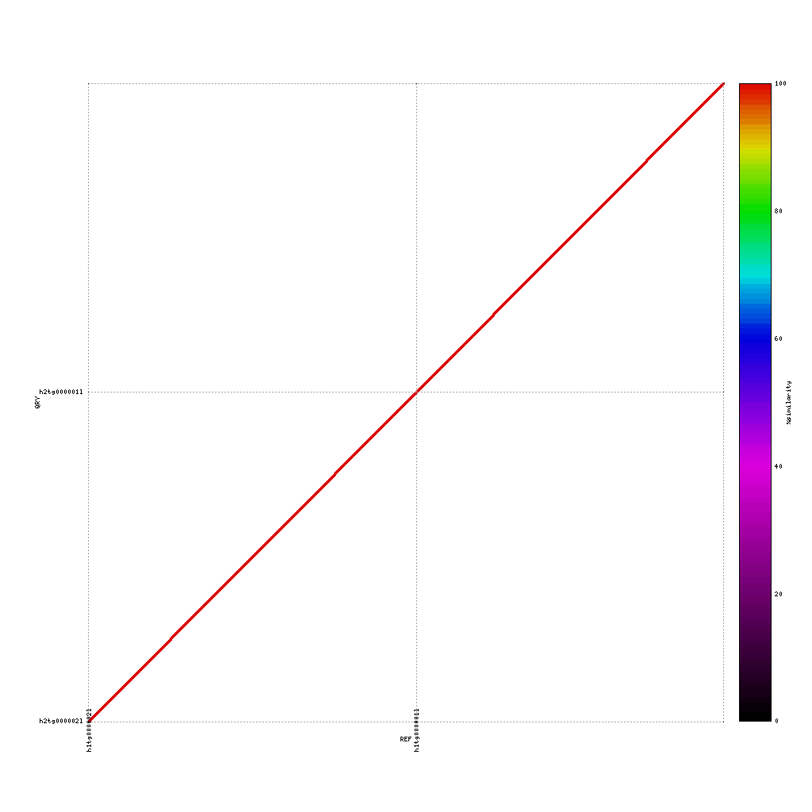

## Evaluating the assemblies through comparisons

A common question to ask after finishing a de novo assembly is how does my new draft sequence looks like compared to either a reference genome or a previously created assembly.

To answer this question, we will use **mummerplot** to align two sequence files to each other and create a nice plot based on these alignments.

The first step is to align two fasta files using **nucmer**. Based on these alignment **mummerplot** will provide a PNG image with the matching regions, colored based on the identity score.

~~~
{{site.vm_prompt}}nucmer REF QUERY --delta=out.delta
{{site.vm_prompt}}mummerplot --color --medium --filter --layout -R REF -Q QUERY --prefix OUTPUT_PREFIX --fat --png out.delta
~~~
{: .bash}

> ## Haplotypes of hifiasm
> Hifiasm generates two haplotpyes, next to the primary assembly. These haplotypes can be very different in many species, so let's see how our haplotypes compare. Use nucmer and mummerplot to create PNG of the comparison and discuss your results. How similar are they for example?
> > ## Solution
> > ~~~
> > {{site.vm_prompt}}mkdir mummer; cd mummer
> > {{site.vm_prompt}}nucmer ../hifiasm_hifi/hifiasm_hifi_hap1.fa ../hifiasm_hifi/hifiasm_hifi_hap2.fa --delta=hifiasm_hifi_hap1_hap2.delta
> > {{site.vm_prompt}}mummerplot --color --medium --filter --layout -Q ../hifiasm_hifi/hifiasm_hifi_hap2.fa -R ../hifiasm_hifi/hifiasm_hifi_hap1.fa --prefix hifiasm_hifi_hap1_hap2 --fat --png hifiasm_hifi_hap1_hap2.delta
> > ~~~
> > {: .bash}
> > 
> {: .solution}
{: .challenge}
> ## Comparison to the kiwifruit reference genome
> Use both applications to compare the four assemblies to the reference sequence:
> Use both applications to compare the four assemblies to the reference sequence:
>~~~
> ./data/references/reference1MB.fasta
>~~~
>{: .bash}
> > ## PacBio vs. reference genome
> >~~~
> >~~~
> >{: .bash}
> >
> {: .solution}
> > ## Nanopore vs. reference genome
> >~~~
> >~~~
> >{: .bash}
> >
> {: .solution}
> Now discuss:
> 
> 1. What do you see? 
> 2. Are the assemblies similar to the reference or not? And why (not)?
> 3. Which sequencing platform do you prefer?
{: .challenge}

> ## Comparison of assemblies
> In our case we have data from three different platforms. In this exercise you will compare each of the assemblies to the others. In theory these assemblies should match perfectly, as they are from the same samples. However, the number of contigs in each of the assemblies already showed that this is not the case. How do the contigs compare on a nucleotide level?
> > ## PacBio vs. Nanopore
> >~~~
> >./tools/mummer-4.0.0beta2/nucmer --nosimplify --maxmatch ./results/canu_pacbio/canu_pacbio.contigs.fasta ./results/canu_nanopore/canu_nanopore.contigs.fasta --delta=./results/mummer/pacbio_nanopore.delta
> >./tools/mummer-4.0.0beta2/mummerplot  --color --medium --layout -R ./results/canu_pacbio/canu_pacbio.contigs.fasta -Q ./results/canu_nanopore/canu_nanopore.contigs.fasta --prefix ./results/mummer/pacbio_nanopore --fat --png ./results/mummer/pacbio_nanopore.delta
> >~~~
> >{: .bash}
> >
> {: .solution}
{: .challenge}

## Putting it all together
In the previous session and in this session we collected information about the raw data and the de novo assemblies.
> ## Best assembly
> Given all the evidence, please indicate which assembly would you prefer and why? Most importantly, indicate which trade-off did you make in selecting (number of contigs, repeat content, basecalling quality, quality of the reads, etc).
{: .challenge} 

