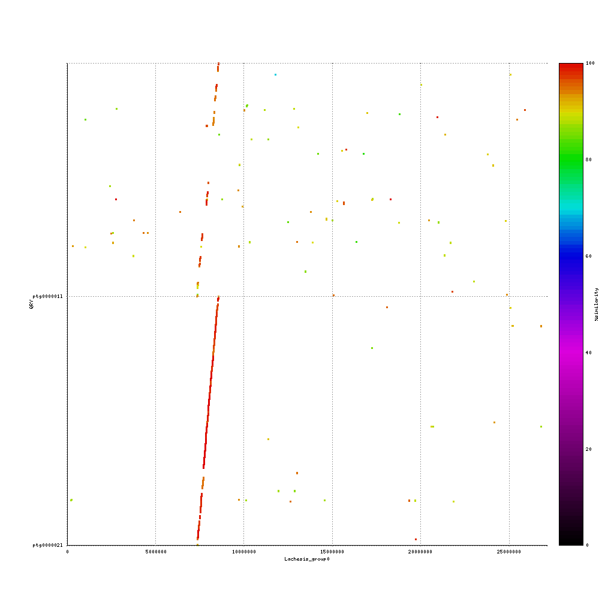
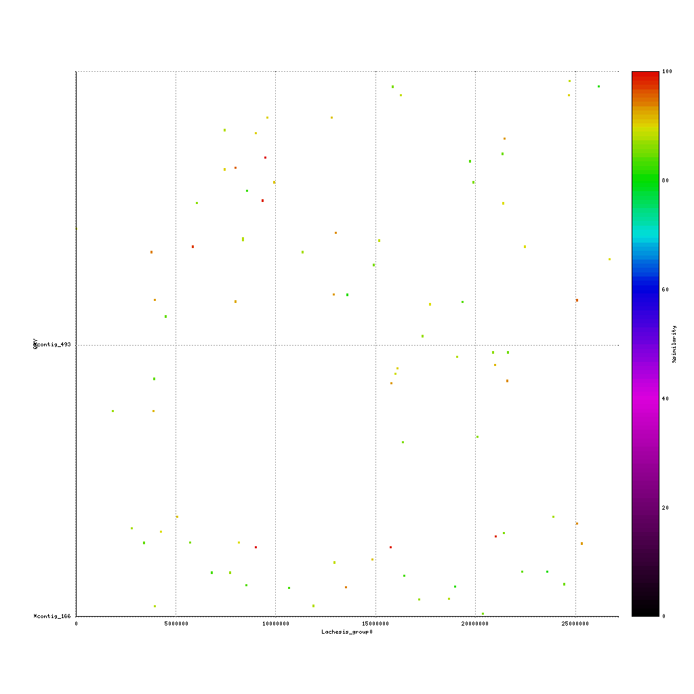
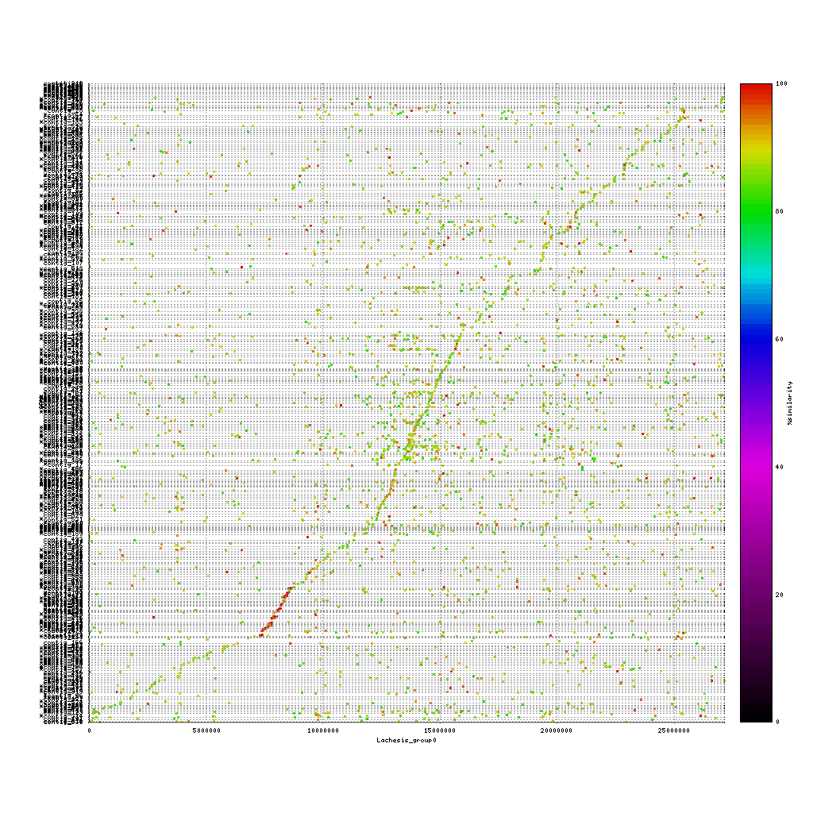

## Evaluating the assemblies through comparisons

A common question to ask after finishing a de novo assembly is how does my new draft sequence looks like compared to either a reference genome or a previously created assembly.

To answer this question, we will use **mummerplot** to align two sequence files to each other and create a nice plot based on these alignments.

The first step is to align two fasta files using **nucmer**. Based on these alignment **mummerplot** will provide a PNG image with the matching regions, colored based on the identity score.

~~~
{{site.vm_prompt}}nucmer REF QUERY --delta=out.delta
{{site.vm_prompt}}mummerplot --color --medium --filter --layout -R REF -Q QUERY --prefix OUTPUT_PREFIX --fat --png out.delta
~~~
{: .bash}

> ## Haplotypes of hifiasm
> Hifiasm generates two haplotpyes, next to the primary assembly. These haplotypes can be very different in many species, so let's see how our haplotypes compare. Use nucmer and mummerplot to create PNG of the comparison and discuss your results. How similar are they for example?
> > ## Solution
> > ~~~
> > {{site.vm_prompt}}mkdir mummer; cd mummer
> > {{site.vm_prompt}}nucmer ../hifiasm_hifi/hifiasm_hifi_hap1.fa ../hifiasm_hifi/hifiasm_hifi_hap2.fa --delta=hifiasm_hifi_hap1_hap2.delta
> > {{site.vm_prompt}}mummerplot --color --medium --filter --layout -Q ../hifiasm_hifi/hifiasm_hifi_hap2.fa -R ../hifiasm_hifi/hifiasm_hifi_hap1.fa --prefix hifiasm_hifi_hap1_hap2 --fat --png hifiasm_hifi_hap1_hap2.delta
> > ~~~
> > {: .bash}
> > 
> {: .solution}
> To verify the results you can map both haplotypes to the primary assembly with minimap2 and visualize the results using Tablet. Can you spot the difference?
> > ## Solution
> > ~~~
> > {{site.vm_prompt}}cd ~/data/results/minimap
> > {{site.vm_prompt}}minimap2 -a -o hifiasm_hap1_hap2.sam -t 3 -x map-hifi ../hifiasm_hifi/hifiasm_hifi_p.fa ../hifiasm_hifi/hifiasm_hifi_hap1.fa  ../hifiasm_hifi/hifiasm_hifi_hap2.fa
> > ~~~
> > {. bash}
> > There are two deletions and 1 SNP in Hap2 compared to the primary assembly. Hap1 is exactly the same as the primary assembly.
> {. solution}
{: .challenge}

> ## Comparison to the kiwifruit reference genome
> Make mummerplots of the filtered assemblies from our previous session compared to the reference kiwifruit contig.
>~~~
> ~/data/genome/kiwi_contig.fa
>~~~
>{: .bash}
> > ## Hifiasm PacBio vs. reference genome
> >~~~
> > nucmer ~/data/genome/kiwi_contig.fa ../hifiasm_hifi/hifiasm_hifi_p.fa --delta=ref_hifiasm_hifi_p.delta
> > mummerplot --color --medium --filter --layout -Q ../hifiasm_hifi/hifiasm_hifi_p.fa -R ~/data/genome/kiwi_contig.fa --prefix ref_hifiasm_hifi_p --fat --png ref_hifiasm_hifi_p.delta
> >~~~
> >{: .bash}
> >
> {: .solution}
> > ## Flye Nanopore vs. reference genome
> >~~~
> > nucmer ~/data/genome/kiwi_contig.fa ../flye_ont/flye_ont_p.fasta --delta=ref_flye_ont_p.delta
> > mummerplot --color --medium --filter --layout -Q ../flye_ont/flye_ont_p.fasta -R ~/data/genome/kiwi_contig.fa --prefix ref_flye_ont_p --fat --png ref_flye_ont_p.delta
> >~~~
> >{: .bash}
> >
> {: .solution}
> > ## Flye hifi vs. reference genome
> >~~~
> > nucmer ~/data/genome/kiwi_contig.fa ../flye_ont/flye_ont.fasta --delta=ref_flye_ont.delta
> > mummerplot --color --medium --filter --layout -Q ../flye_ont/flye_ont.fasta -R ~/data/genome/kiwi_contig.fa --prefix ref_flye_ont --fat --png ref_flye_ont.delta
> >~~~
> >{: .bash}
> >
> {: .solution}
> Now discuss:
> 
> 1. What do you see? 
> 2. Are the assemblies similar to the reference or not? And why (not)?
> 3. Which sequencing platform do you prefer?
{: .challenge}

> ## Flye ONT assembly
> There seems to something wrong with the Flye ONT assembly. Although the length of the largest contigs are similar to those of the hifiasm hifi assembly, the mummerplot does not show any similarity to the reference genome. To investigate this further, make mummerplots of:
> 1. The hifiasm hifi primary filtered assembly against the flye ont filtered assembly
> 2. The reference genomic region against the unfiltered flye ont assembly
> Inspect the results. What are you observations?
> > ## hifiasm hifi primary filtered assembly against the flye ont filtered assembly > >~~~
> >~~~
> >{: .bash}
> {: .solution}
{: .challenge} 
 

